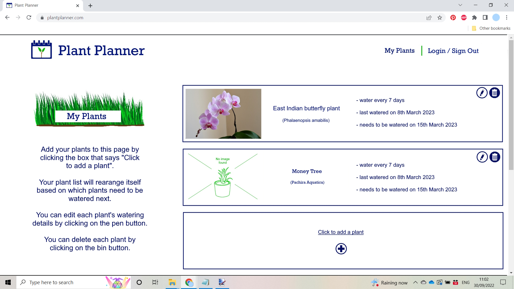
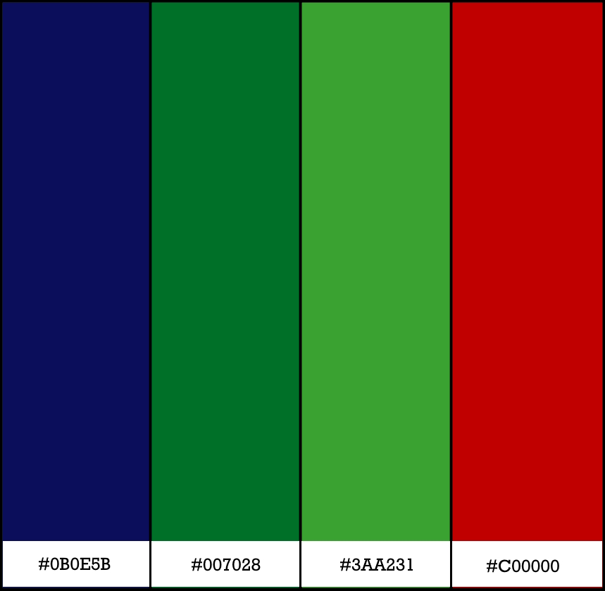

# Plant Planner

This website has been created to help people to know when to water their plants. It has been designed with a range of different screen sizes in mind. 

[View the live project here](https://lithill.github.io/Plant-Planner/)

## Table of Contents

1. [User Experience](#user-experience)
3. [Design](#design)
5. [Features](#features)
6. [Accessibility](#accessibility)
7. [Technologies Used](#technologies-used)
8. [Deployment and Local Development](#deployment-&-local-development)
9. [Testing](#testing)
10. [Credits](#credits)
    
## User Experience

### Initial Discussion

It may be helpful for people with with less-than-green thumbs to have an automated list of when their indoor plants next need to be watered. It is usual for people to just water all of their plants perhaps once a week, but different plants need different amounts of water. 

#### Key information for the site

* How to use the website
* Ability for user to sign up and log in
* Ability for user to add, edit and delete their own plants
* Ability for user to edit when they last watered each plant

### User Stories

#### Client Goals

* To be able to view the site on a range of device sizes.
* To have a list that shows them when they need to water their plants, in order of the plants that need watering the soonest. 

#### First Time Visitor Goals

* To sign up
* To add all their plants 

#### Returning Visitor Goals 

* To sign in
* To edit when they last watered their plants

#### Longer Term Visitor Goals 

* To sign in
* To check when they need to water their plants
* To edit when they last watered their plants

## Design

### Early Design Phases

The design was created desktop-first. 

A clean and unclutered approach was saught, so that the use could easily see the information that they need.

### Colour scheme

The website sparingly uses a palette of neutral natural colours, which was felt to be suitable for a website designed for gardeners. 

### Typography

Google Fonts was used for the following fonts:

* Merriweather is a serif font. This is used for the headings.
* Arimo is a sans-serif font. This is used for all other text.

### Wireframes

The Wireframes were made via [Paint.net](https://www.getpaint.net/).  

#### Mobile Wireframe

#### Desktop Wireframe

## Features

The website is made up of two pages. 

The index page has the following features:

* Buttons:
   * Add button, which adds an 'add a plant' div containing text boxes to the page

   

   * Edit buttons, which enables the user to edit some of the plant information

   

   * Delete buttons, which enables the user to delete a plant div

   

The login page has the following features:

* 

### Future Features

* Add 'feeding' to the plant information. 
* Add email alerts, so that the user can get notifications when they need to water / feed plants.

## Accessibility

I have been mindful during coding to ensure that the website is as accessible as possible. I have achieved this by:

* Using semantic HTML.
* Using descriptive alt attributes on images on the site.
* Supplying information for screen readers where there are icons used and no text, such as footer icons.
* Guaranteeing adequate colour contrast throughout the site.

## Technologies Used

### Languages Used

HTML5, CSS3, Python,  and JavaScript were used to create this website.

### Frameworks, Libraries & Programs Used

* [Google Fonts](https://fonts.google.com/) was used to import East Sea Dokdo and Eater.
* [Git](https://git-scm.com/) was used for version control by using the Gitpod terminal to commit to Git and Push to GitHub.
* [GitHub](https://github.com/) was used to store the projects' code after being pushed from Replit, and to handle version control.
* [Paint.Net](https://www.getpaint.net/download.html) was used to edit the Dall-E 2 images.
* [Chrome Dev Tools](https://developer.chrome.com/docs/devtools/) was used to troubleshoot and test features and solve issues with responsiveness and styling.
* [Am I Responsive?](https://ui.dev/amiresponsive) was used to show the website on a range of devices.
* [Unicorn Revealer](https://chrome.google.com/webstore/detail/unicorn-revealer/lmlkphhdlngaicolpmaakfmhplagoaln?hl=en-GB) was used for debugging.
* [Layoutit!](https://grid.layoutit.com/) was used to create the CSS grid.
* [SQLAlchemy version 1.4.46](https://www.sqlalchemy.org/) was used to connect Python code with the database.
* [Psycopg2](https://www.psycopg.org/docs/) was used to connect Python code with the database. 
* [Flask](#) ?

## Deployment & Local Development

### Deployment

This project was deployed to GitHub Pages using the following steps:

1. Log into GitHub and locate the [GitHub Repository](https://github.com/Lithill/Plant-Planner).
2. Click the settings button (above the "add file" button).
3. Click on "Pages" on the left-hand-side column.
4. Under "Source", click the dropdown called "Main", select folder ""/root" and click "save".
5. Refresh the page.
6. Click on the "Visit site" button at the top of the page.

### Local Deployment

#### How to Fork

To fork the Plant Planner repository:

1) Log in (or sign up) to GitHub.
2) Go to the repository for this project, at [GitHub Repository](https://github.com/Lithill/Plant-Planner).
3) Click the Fork button in the top right corner.

#### How to Clone

To clone the Plant Planner repository:

1) Log in (or sign up) to GitHub.
2) Go to the repository for this project, at [GitHub Repository](https://github.com/Lithill/Plant-Planner).
3) Above the list of files, click "Code".
4) Click "Open with GitHub Desktop" to clone and open the repository with GitHub Desktop.
5) Click "Choose..." and, using Windows Explorer, navigate to a local path where you want to clone the repository.
6) Click "Clone".

### How to set up the gitpod environment after session times out:
   In the terminal type:
      - set_pg
      - psql
   
### How to run the server to see the website in the browser:
   In the terminal type:
      - python3 run.py
   
### Installations and commands in the terminal - needed if forking or using a different workspace
   * pip3 install 'Flask-SQLAlchemy<3' psycopg2 sqlalchemy==1.4.46
   * pip install flask-wtf
   * pip install flask-sqlalchemy
   * To create a working database in the workspace:
      - set_pg
      - psql
      - CREATE DATABASE plantplanner;
      - \q
      - python3
      - from plantplanner import db
      - db.create_all()
      - exit()
   * To delete the database (please note that you must delete and re-create the database if you change the models. Migration is not set up)
      - set_pg
      - psql
      - DROP DATABASE plantplanner;
      - \q
   * pipenv install python-dotenv
   * pip install flask_login
   * pip install flask-ckeditor
   
## Testing

Testing was ongoing throughout the entire build. I utilised Chrome developer tools while building to pinpoint and troubleshoot any issues as I went along. Both manual and automated testing were employed. The difference between these two types of tests is that:

* manual testing is conducted by a person, who is seeing if they can break the product, or otherwise whether it behaves as expected for users.
* automatic testing is conducted by automation frameworks, or some other kind of tool or piece of software. 

I personally tested the page and had X people also manually test it on their own devices. For automated testing, I used W3C validator, CSS validator and Lighthouse.  

### W3C Validator

The [W3C HTML Validator](https://validator.w3.org/) was used to validate the HTML on all pages of the website. 

Results from the [check](#).

### CSS Validator

The [W3C CSS Validator](https://jigsaw.w3.org/css-validator/) was used to validate the CSS in the style.css file.

Results from the [check](#).

### JSHint Validator

The [JSHint Validator](https://jshint.com/) was used to validate the JavaScript in the script.js file.

Results from the [check](#).

### Solved Bugs

1.
   1. Expected behaviour: Form is visible when navigating to test_pw.html
   2. Actual behaviour: Jinja error - AttributeError: 'PasswordForm' object has no attribute 'validate_on_submit'
   3. Solution: Import FlaskForm from flask_wtf, and pass FlaskForm into the form.

2.
   1. Expected behaviour: 
   2. Actual behaviour: 
   3. Solution: 

### Known Bugs

No currently known bugs.

### Lighthouse

I used Lighthouse through Chrome Developer Tools to test accessibility, performance, best practices and SEO of the website.

#### Initial Testing

[Mobile](#)

Improvements recommended:

* 

#### Fixes and Most Recent Lighthouse Testing

After fixing the recommended areas, this is the lighthouse tests that the webpage received:

[Desktop](#) ~ [Mobile](#)

### Full Testing

To fully test my website, I used Google Chrome Developer Tools to ensure that the page was responsive on all available screen sizes. Testing was performed on a variety of browsers (Chrome, Microsoft Edge and Firefox) and devices (Gigabyte gaming laptop, iPhone SE, Android one+ 9 mobile, Lenovo Legion Laptop, Huawei P Smart Phone, Fair Phone).

#### Buttons:

Tested each button on the page. Each button worked as expected or was appropriately disabled. All buttons were clicked during a variety of game-play-states, and in a variety of orders. 

## Credits

Thanks are given for the following blogs and tutorials:

* [How to Clear Input Fields in JavaScript](https://linuxhint.com/clear-input-fields-javascript/#2)
on the linuxhint website. 
* [Good explanation of cascade (ON DELETE/UPDATE) behavior](https://dba.stackexchange.com/questions/44956/good-explanation-of-cascade-on-delete-update-behavior)
by Johntron on Stack Exchange. 
* [Good tutorial of flash in Flask](https://www.youtube.com/watch?v=abCSKRMGZ3A)
on Comedy.com's youtube channel. 
* [Good tutorial of password hashing in Flask](https://www.youtube.com/watch?v=8ebIEefhBpM)
on Comedy.com's youtube channel. 

### Code Used

* [Codemy's walkthrough](https://www.youtube.com/watch?v=0Qxtt4veJIc&list=PLCC34OHNcOtolz2Vd9ZSeSXWc8Bq23yEz&index=1)
was used to set up the initial bones of the project. 
* [coding Yaar's](https://codingyaar.com/responsive-bootstrap-navbar-right-align/)
custom code for right-align bootstrap navbars. 
* [coding Yaar's](https://codingyaar.com/responsive-bootstrap-navbar-with-vertical-line-separator/)
custom code for vertical line separated bootstrap navbar links. 

### Content

Content for the website was made by Rossanne Hamilton.

### Media Used

* [Ttreis's image on Pixabay](https://pixabay.com/vectors/calendar-icon-minimalist-time-1559935/) was edited to create the logo. 
* [OpenClipart-Vector's image on Pixabay](https://pixabay.com/vectors/sapling-plant-growing-seedling-154734/) was edited and added to the above image to create the logo. 
* [Janjf93's image on Pixabay](https://pixabay.com/vectors/icon-symbol-pen-pencil-design-art-1970472/) was edited and used as the edit button. 
* [Table's image on Pixabay](https://pixabay.com/de/illustrations/m%c3%bcll-m%c3%bclleimer-l%c3%b6schen-abfall-2091534/) was edited and used as the delete button. 
* [Clker Free Vector Images's image on Pixabay](https://pixabay.com/de/vectors/tick-komplett-pr%c3%bcfen-rechts-27406/) was edited and used as the save button. 
* [NikkiGoCom's image on Pixabay](https://pixabay.com/de/vectors/gras-wiese-pflanze-gr%c3%bcn-fr%c3%bchling-6358622/) was used for the image behind the page titles. 
* [Eliona's image on Pixabay](https://pixabay.com/de/illustrations/pfeil-zeigen-anzeigen-drehen-1314462/) was edited and used for the back button. 
* The add button was made by the creator.

### Acknowledgements

I would like to acknowledge the following people who helped me along the way in completing my second milestone project:

- My mentor Mitko Bachvarov for helpful feedback and sharing links for further learning.
- My tutor Robert Mclaughlin for helpful feedback and sharing links for further learning.