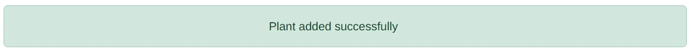
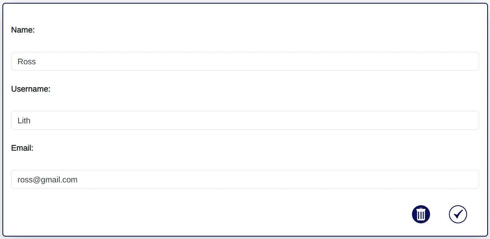

# Plant Planner

This website has been created to help people to know when to water their plants. It has been designed with a range of different screen sizes in mind. 

[View the live project here](https://plant-planner-app.herokuapp.com/)

## Table of Contents

1. [User Experience](#user-experience)
3. [Design](#design)
5. [Features](#features)
6. [Accessibility](#accessibility)
7. [Technologies Used](#technologies-used)
8. [Deployment and Local Development](#deployment-and-local-development)
9. [Testing](#testing)
10. [Credits](#credits)
    
## User Experience

### Initial Discussion

It may be helpful for people with with less-than-green thumbs to have an automated list of when their indoor plants next need to be watered. It is usual for people to just water all of their house plants at the same time, perhaps once a week, but different plants need different amounts of water. 

#### Key information for the site

* How to use the website
* Ability for user to sign up and log in
* Ability for user to add, edit and delete their own plants
* Ability for user to edit when they last watered each plant

### User Stories

#### Client Goals

* To be able to view the site on a range of device sizes.
* To have a list that shows them when they need to water their plants, in order of the plants that need watering the soonest. 

#### First Time Visitor Goals

* To sign up
* To add all their plants 

#### Returning Visitor Goals 

* To sign in
* To edit when they last watered their plants

#### Longer Term Visitor Goals 

* To sign in
* To edit when they last watered their plants
* To check when they need to water their plants

## Design

### Early Design Phases / Wireframes

The Wireframes were made via [Paint.net](https://www.getpaint.net/).

A clean and unclutered approach was sought, so that the user could easily see the information they needed.

This website was designed desktop-first. This caused issues further on in development.

This is because it was decided early on that Bootstrap would be used in order to speed up the process. But at the time this decision was made, it wasn't understood that Bootstrap is a mobile-first framework.

The design also changed during development because it was felt that the base template functionality of Flask could be better utilised. This in turn helped to create a more uniform user interface.

### Colour scheme

The website sparingly uses a colour palette often found in nature. This was felt to be suitable for a website designed for gardeners. 

### Typography

Google Fonts was used to import the following fonts:

* Merriweather is a serif font. This is used for the navigation bar and headings.
* Arimo is a sans-serif font. This is used for all other text.  

## Features

The website is made up of 9 pages:

* Index
* Register
* Log in
* Account dashboard
* Edit account
* My plants
* Plant profile
* Add plants
* Edit plants

### Index

The index page has the following features:

If the user is not signed in, they will see the following buttons:

   * Log in button, which takes the user to the log in page

   

   * Register button, which takes the user to the registration page

   

If the user is signed in, they will see the following buttons:

   * Add button, which takes the user to the "Add Plant" page.

   

   * View your plants button, which takes the user to their plants page. 

   

### Register

The registration page has the following features:

* A form that takes the users name, username, email address and password, and sends this to the database. 

   

* The password is hidden from view, and confirmed using two password fields. 

   

* Form validation is set up for all fields. This appears if the user leaves any fields blank, or if their passwords do not match.

   

* Button to submit the form. When the form is submitted, this creates a user account, and takes the user to the login page.

   

* A flash message appears on the next page when the user has created a new account successfully. 

   

### Log in

The log in page has the following features:

* A form that takes the users username and password, and compares these to those stored in the database to verify the users identify. 

   

* Form validation is set up for all fields. This appears if the user leaves any fields blank. 

   

* Button to submit the form. When the form is submitted, this authenticates the user, and takes them to their plants page.

   

* A flash message appears on the next page when the user has logged in successfully. 

   

### My plants 

This page has the following features:

* A button that takes you to the Add Plant page

   

* Self populating plant divs that pull your saved plants data from the database and displays them. These are automatically ordered by the date the plants next need to be watered, so that the plants most in need of watering are at the top. Plants that need watering also have red text to alert the user. The tense of the text also changes depending on whether you needed to have watered the plants in the past, need to water them today, or if you need to water them in the future.

   

* Each plant has its own set of buttons which will perform actions on that particular plant:

   * The "see more" button takes the use to a page dedicated to that particular plant, where they will be able to see the plant's notes.

      
   
   * The edit button takes the user to a page where they can edit the details of the plant.

      
   
   * The "delete" button displays a modal which confirms that the user would like to delete the plant in question.

      
      
* The delete modal confirms with the user that they would like to delete their plant

   

   This modal has two buttons.

   * One button will hide the modal

      

   * The other button will delete the plant and then hide the modal

      

### Add plant

This page has the following features:

* A form to add a new plant to the database. It asks the user for these details of the plant - Common Name / Latin Name / Watering Interval / Date Last Watered / Notes.

   

   This form includes:

   * Validation warnings when required fields (Common Name, Latin Name, Watering Interval and Date Last Watered) are not completed. Form validation also alerts the user if they type in a watering interval that is less than 1, or type in a last watered date that is in the past.  

      

   * A notes section with a variety of different formatting abilities
   
      

   * A back button that takes the user to their "My Plants" page

      

   * A submit button that submits the form data to the database, and redirects the user to their "My Plants" page. 

      
   
   * Tooltips that appear when the user hovers their mouse over each field label. (They do not appear all at the same time. The below is meant as a quick visual reference only.) 

      

      

   * A flash message that appear on the page after the user has successfully added a plant

      

### Plant profile

This page has the following features:

* A div that contains all of the information of the plant that the user previously selected. This includes the watering text appearing red if the user needs to water their plant.

    

   * Edit button, which takes the user to the plant edit page.

      

   * Back button, which takes the user to the my plants page. 

      

   * Delete button, which triggers the delete modal.

      

   * Delete modal, which confirms that the user would like to delete the plant. 

      

      * This modal has the following features:

         * Delete button, which will delete the plant and return the user to the My Plants page. 

            
         
         * Close button, which will close the delete modal without deleting the plant. 

            

### Edit plants

This page has the following features:

* A pre-populated form containing all of the details of the plant the user would like to edit. 

   

   This form includes:

   * The same validation that has been previously mentioned for the Add Plant page. 

      
   
   * Back button, which takes the user back to the My Plants page. 

      

   * Save button, which saves the edited data to the database, and returns the user to the plant profile page. 

      
   
   * Tooltips that appear when the user hovers their mouse over each field label. (They do not appear all at the same time. The below is meant as a quick visual reference only.) 

      

      

   * A flash message that appear on the page after the user has successfully added a plant

      

### Account dashboard

This page has the following features:

* The details that the user added during registration, apart from their password. 

   

* Edit button, which takes users to the edit account page. 

   

* Delete button, which opens a delete modal.

   

* Delete modal, which confirms with the user that they want to delete their account.

   

   This modal has the following features:

   * Delete button, which triggers the deleting of the user, and all the plants associated with them. Then redirects them to the registration page. 

      

   * close button, which closes the modal without deleting the user account. 

      

### Edit account

This page has the following features:

* Pre-populated information about the user. 

   

* Validation alerts that require the user to make sure all fields are filled in.

   

* Save button, which saves the updated user information, and redirects the user to their account.

   

* Delete button, which triggers the delete modal.

   

* Delete modal, which confirms with the user that they want to delete their account.

   

   This modal has the following features:

   * Delete button, which triggers the deleting of the user, and all the plants associated with them. Then redirects them to the registration page. 

      

   * close button, which closes the modal without deleting the user account. 

      

* Flash message on the next page to let the user know that they have successfully updated an account.

   

### 404 page

This page has the following features:#

* Informtion to show the user that the page they were looking for wasn't found.

   

### All pages have the following features

This page has the following features:

* Navigation bar, that turns into a hamburger menu on narrower screens. The links included go to the register, login, add a plant and my plants pages. Clicking on "Plant Planner" of the calendar plant icon will also take the user to the home page.

   

   

* Footer, which includes working buttons to the home pages of instagram, twitter and facebook.

   

* Page title and information section, which changes depending on which page the user is on. 

   

### Future Features

* Add 'feeding' to the plant information. 
* Add email alerts, so that the user can get notifications when they need to water / feed plants.
* Add ability for user to change their password
* Add ability to differentiate between different months, as plants often need a different amount depending on the time of year. 

## Accessibility

I have been mindful during coding to ensure that the website is as accessible as possible. I have achieved this by:

* Using semantic HTML.
* Using descriptive alt attributes on images on the site.
* Supplying information for screen readers where there are icons used and no text, such as footer icons.
* Guaranteeing adequate colour contrast throughout the site.

## Technologies Used

### Languages Used

HTML5, CSS3, Python, and JavaScript were used to create this website.

### Frameworks, Libraries & Programs Used

* [Google Fonts](https://fonts.google.com/) was used to import Merriweather and Arimo.
* [Git](https://git-scm.com/) was used for version control by using the Gitpod terminal to commit to Git and Push to GitHub.
* [GitHub](https://github.com/) was used to store the projects' code, and to handle version control.
* [Paint.Net](https://www.getpaint.net/download.html) was used to edit and crop images.
* [Chrome Dev Tools](https://developer.chrome.com/docs/devtools/) was used to troubleshoot and test features and solve issues with responsiveness and styling.
* [Am I Responsive?](https://ui.dev/amiresponsive) was used to show the website on a range of devices.
* [Unicorn Revealer](https://chrome.google.com/webstore/detail/unicorn-revealer/lmlkphhdlngaicolpmaakfmhplagoaln?hl=en-GB) was used for debugging.
* [SQLAlchemy](https://www.sqlalchemy.org/) was used to connect Python code with the database.
* [Psycopg2](https://www.psycopg.org/docs/) was used to connect Python code with the database. 
* [Flask](https://flask.palletsprojects.com/en/2.2.x/) is the web application framework which was used to build the website.
* [Bootstrap 5](https://getbootstrap.com/) was used for responsive and pre-designed CSS.
* [PostgreSQL](https://www.postgresql.org/) was the object-relational database system used.
* [ElephantSQL](https://www.elephantsql.com/) was used to host the database.
* [Heroku](https://www.heroku.com/) was used to deploy the website.

## Deployment and Local Development

### Deployment

This project was deployed to Heroku using the following steps:

#### ElephantSQL

1. Navigate to ElephantSQL.com and create a user account, using log in with GitHub.
2. Click “Create New Instance”
3. Set up your plan. (You can leave the 'tags' field blank.)
4. Select region.
5. Select a data center near you
6. Then click “Review”
7. Check your details are correct and then click “Create instance”
8. Return to the ElephantSQL dashboard and click on the database instance name for this project
9. In the URL section, clicking the copy icon will copy the database URL to your clipboard
10. Leave this tab open, we will come back here later

#### Heroku

1. Log into Heroku.com and click “New” and then “Create a new app”
2. Choose a unique name for your app, select the region closest to you and click “Create app”
3. Go to the Settings tab of your new app
4. Click Reveal Config Vars
5. Return to your ElephantSQL tab and copy your database URL
6. Back on Heroku, add a Config Var called DATABASE_URL and paste your ElephantSQL database URL in as the value. Make sure you click “Add”
7. Add each of your other environment variables except DEVELOPMENT and DB_URL from the env.py file as a Config Var. 
8. Navigate to the “Deploy” tab of your app.
9. In the Deployment method section, select “Connect to GitHub”
10. Search for your repo and click Connect
11. Optional: You can click Enable Automatic Deploys in case you make any further changes to the project. This will trigger any time code is pushed to your GitHub repository
12. As we already have all our changes pushed to GitHub, we will use the Manual deploy section and click Deploy Branch. This will start the build process. When finished, it should look something like this
13. Now, we have our project in place, and we have an empty database ready for use. As you may remember from our local development, we still need to add our tables to our database. To do this, we can click the “More” button and select “Run console”
14. Type python3 into the console and click Run
15. In the terminal that opens, write "from plantplanner import db" and then press enter.
16. In the terminal, write "db.create_all()" and then press enter.
17. Exit the Python terminal, by typing exit() and hitting enter, and close the console. Our Heroku database should now have the tables and columns created from our models.py file.
18. The app should be up and running now, so click the “Open app” button

### Local Deployment

#### How to Fork

To fork the Plant Planner repository:

1) Log in (or sign up) to GitHub.
2) Go to the repository for this project, at [GitHub Repository](https://github.com/Lithill/Plant-Planner).
3) Click the Fork button in the top right corner.

#### How to Clone

To clone the Plant Planner repository:

1) Log in (or sign up) to GitHub.
2) Go to the repository for this project, at [GitHub Repository](https://github.com/Lithill/Plant-Planner).
3) Above the list of files, click "Code".
4) Click "Open with GitHub Desktop" to clone and open the repository with GitHub Desktop.
5) Click "Choose..." and, using Windows Explorer, navigate to a local path where you want to clone the repository.
6) Click "Clone".

### How to set up the gitpod environment after session times out:
   In the terminal, type:
      - set_pg
      - psql
   
### How to run the server to see the website in the browser:
   In the terminal, type:
      - python3 run.py
   
   Make sure that you consistently run this and the above commands in the same terminal. Not doing this will cause errors. 
   
### Installations and commands in the terminal - needed if forking or using a different workspace
   * pip3 install 'Flask-SQLAlchemy<3' psycopg2 sqlalchemy==1.4.46
   * pip install flask-wtf
   * pip install flask-sqlalchemy
   * To create a working database in the workspace:
      - set_pg
      - psql
      - CREATE DATABASE plantplanner;
      - \q
      - python3
      - from plantplanner import db
      - db.create_all()
      - exit()
   * To delete the database (please note that you must delete and re-create the database if you change the models. Migration is not set up)
      - set_pg
      - psql
      - DROP DATABASE plantplanner;
      - \q
   * pipenv install python-dotenv
   * pip install flask_login
   * pip install flask-ckeditor

## Testing

Testing was ongoing throughout the entire build. I utilised Chrome developer tools while building to pinpoint and troubleshoot any issues as I went along. Both manual and automated testing was employed. The difference between these two types of tests is that:

* manual testing is conducted by a person, who is seeing if they can break the product, or otherwise whether it behaves as expected for users.
* automatic testing is conducted by automation frameworks, or some other kind of tool or piece of software. 

I personally tested the page and had 3 people also manually test it on their own devices. For automated testing, I used W3C validator, CSS validator, Python Checker and Lighthouse.  

### W3C Validator

The [W3C HTML Validator](https://validator.w3.org/) was used to validate the HTML on all pages of the website. 

* Results from the [404](plantplanner/static/images/readme/404_val.webp) page check.
* Results from the [500](plantplanner/static/images/readme/500_val.webp) page check.
* Results from the [account](plantplanner/static/images/readme/account_val.webp) page check.
* Results from the [add_plant](plantplanner/static/images/readme/add_plant_val.webp) page check.
   
   The warning shown derives purely from the jinja code, which as far as I am aware, is necessary to accept if I want to use Jinja in this way. 

* Results from the [add_user](plantplanner/static/images/readme/add_user_val.webp) page check.
* Results from the [edit_plant](plantplanner/static/images/readme/edit_plant_val.webp) page check.

   The errors shown derive purely from the jinja code.

* Results from the [index](plantplanner/static/images/readme/index_val.webp) page check: user not logged in.
* Results from the [index](plantplanner/static/images/readme/index_logged_in_val.webp) page check: user logged in.
* Results from the [login](plantplanner/static/images/readme/login_val.webp) page check.

   The errors shown derive purely from the jinja code.

* Results from the [plant](plantplanner/static/images/readme/plant_val.webp) page check.
* Results from the [update](#) page check.

### CSS Validator

The [W3C CSS Validator](https://jigsaw.w3.org/css-validator/) was used to validate the CSS in the style.css file.

Results from the [check](#).

### JSHint Validator

The [JSHint Validator](https://jshint.com/) was used to validate the JavaScript in the script.js file.

Results from the [check](#).

### Pep8 Validator

The [Python Validator](https://www.pythonchecker.com/) was used to validate the Python code.

Results from the [check](#).

### Solved Bugs

| Bug Number  | Expected behaviour | Actual behaviour | Solution |
| ---:        |    :----:          |        :----:    | :---     |
| 1  | Form is visible when navigating to test_pw.html | Jinja error - AttributeError: 'PasswordForm' object has no attribute 'validate_on_submit' | Import FlaskForm from flask_wtf, and pass FlaskForm into the form. |
| 2  | Button images continue to be visible after deleting a plant from the plant.html page  | Button images break after deleting a plant from the plant.html page | src code needed Jinja template. (E.g. {{ url_for('static', filename='images/add.webp') }}) |
| 3  | When clicking on buttons on plants page, they always work | Clicking on buttons on plants page does not work when three plants image div is over it | Move three plants image |
| 4  | Plants list is always in order of when plants need to be watered - soonest at the top | Plants list re-orders itself after deleting a plant | Did not change code on the delete route when added the list-by-water-date functionality |
| 5  | When user is deleted, user should be redirected back to register page, and not appear signed in | When user is deleted, user looks like they are on "My Plants" page, and can see "Logout" on the navbar | Change instructions, and add logout to the routes file |
| 6  | Individual plant pages should only be visible to logged-in user | Individual plant pages can be viewed by other users and people not logged in | Add login required to routes, and jinja if statement to html page |
| 7  | Cannot see plant that belongs to a deleted user | Can see plant after deleting the user. (this means that cascade delete isn't working AND user auth isn't working on the single plant page. Is user somehow still logged in? Is the model not set up correctly?) | Add delete ascade to user model |
| 8  | For there only to be one horizontal line above each plant on the My Plants page | There are extra lines at the bottom of plants in the My Plants page | Move the horizontal line into the if statement on the plants page |
| 9  | User registration form tells the user when their passwords do not match | Does not tell the user when their passords do not match | Added form validation via JavaScript |
| 10  | When username is entered and submitted on the update user form that is longer than 20 characters long, it should warn the user this is not acceptable | When username is entered and submitted on the update user form that is longer than 20 characters long, it returns a SQLalchemy "PendingRollbackError" | Add maxlength to the username field on the edit user form |
| 11  | If there is no input in water interval and last watered fields on add plant form, then they will show a warning | Even if there is no input in these fields, they will not show a warning if the common name field is filled out. This is also happening on the edit page - from common name | Added datarequired validators to flask plant forms |
| 12 | Plant form does not submit if the date is in the future | Plant form submits if date is in the future | Add max date to input in html |

### Known Bugs

| Bug Number  | Expected behaviour | Actual behaviour | Solution |
| ---:        |    :----:          |        :----:    | :---     |
| 11  | Email entered on user forms would need an @ and . before being accepted | Strings of just letters are being accepted | Solution |

Since adding "let rightRangeBool" to edit plant form, the alert has stopped working properly for the water interval field (but not on the add plant form? It is the same JavaScript)

### Lighthouse

I used Lighthouse through Chrome Developer Tools to test accessibility, performance, best practices and SEO of the website.

#### Initial Testing

[Mobile](#)

Improvements recommended:

* 

#### Fixes and Most Recent Lighthouse Testing

After fixing the recommended areas, this is the lighthouse tests that the webpage received:

[Desktop](#) ~ [Mobile](#)

### Full Testing

To fully test my website, I used Google Chrome Developer Tools to ensure that the page was responsive on all available screen sizes. Testing was performed on a variety of browsers (Chrome, Microsoft Edge and Firefox) and devices (Gigabyte gaming laptop, iPhone SE, Android one+ 9 mobile, Lenovo Legion Laptop, Huawei P Smart Phone, Fair Phone).

#### Buttons:

Tested each button on the page. Each button worked as expected or was appropriately disabled. All buttons were clicked during a variety of game-play-states, and in a variety of orders. 

## Credits

Thanks are given for the following posts and tutorials:

* [Good explanation of cascade (ON DELETE/UPDATE) behavior](https://dba.stackexchange.com/questions/44956/good-explanation-of-cascade-on-delete-update-behavior)
by Johntron on Stack Exchange. 
* [Good tutorial of flash in Flask](https://www.youtube.com/watch?v=abCSKRMGZ3A)
on Comedy.com's youtube channel. 
* [Cognitive Robot's post on Stack Overflow](https://stackoverflow.com/questions/52674364/flask-app-cant-passing-a-value-to-a-confirmation-modal-before-deleting-a-post)
helped me understand how to write the delete plant modal. 

### Code Used

* [Codemy's Flask Blog walkthrough](https://www.youtube.com/watch?v=0Qxtt4veJIc&list=PLCC34OHNcOtolz2Vd9ZSeSXWc8Bq23yEz&index=1)
was used to set up the initial bones of the project. 
* [Coding Yaar's](https://codingyaar.com/responsive-bootstrap-navbar-right-align/)
custom code for right-align bootstrap navbars. 
* [Coding Yaar's](https://codingyaar.com/responsive-bootstrap-navbar-with-vertical-line-separator/)
custom code for vertical line separated bootstrap navbar links. 
* [Pablo Santa Cruz's](https://stackoverflow.com/questions/25120621/python-get-date-in-future-x-days-and-hours-left-to-date)
 code for calculating dates. 
 * [Shinichi Okada's](https://medium.com/mkdir-awesome/how-to-change-the-bootstrap-5-tooltip-background-and-arrow-color-67e6c5aea510)
 code for customising bootstrap tooltips. 
  * [w3schools](https://www.w3schools.blog/email-validation-javascript-js)
 code for email validation was adapted for the validateEmail javascript function. 
 * [Samuel Meddows'](https://stackoverflow.com/questions/1531093/how-do-i-get-the-current-date-in-javascript)
 code was used for the "today" javascript function. 

### Content

Content for the website was made by Rossanne Hamilton.

### Media Used

* [Ttreis's image on Pixabay](https://pixabay.com/vectors/calendar-icon-minimalist-time-1559935/) was edited to create the logo. 
* [OpenClipart-Vector's image on Pixabay](https://pixabay.com/vectors/sapling-plant-growing-seedling-154734/) was edited and added to the above image to create the logo. 
* [Janjf93's image on Pixabay](https://pixabay.com/vectors/icon-symbol-pen-pencil-design-art-1970472/) was edited and used as the edit button. 
* [Table's image on Pixabay](https://pixabay.com/de/illustrations/m%c3%bcll-m%c3%bclleimer-l%c3%b6schen-abfall-2091534/) was edited and used as the delete button. 
* [Clker Free Vector Images's image on Pixabay](https://pixabay.com/de/vectors/tick-komplett-pr%c3%bcfen-rechts-27406/) was edited and used as the save button. 
* [NikkiGoCom's image on Pixabay](https://pixabay.com/de/vectors/gras-wiese-pflanze-gr%c3%bcn-fr%c3%bchling-6358622/) was used for the image behind the page titles. 
* [Eliona's image on Pixabay](https://pixabay.com/de/illustrations/pfeil-zeigen-anzeigen-drehen-1314462/) was edited and used for the back button.
* [Coffeebeanworks' image on Pixabay](https://pixabay.com/illustrations/social-media-social-media-icons-2083456/) was edited and used for the social media icons.
* [Mohamed Hassan's image on Pixabay](https://pixabay.com/illustrations/eye-computer-icon-vector-2387853/) was edited and used for the view button. 
* [Clker-Free-Vector-Images' image on Pixabay](https://pixabay.com/vectors/question-mark-question-icon-blue-310100/) was edited and used for the question button. 
* The add button was made by the creator.

### Acknowledgements

I would like to acknowledge the following people who helped me along the way in completing my second milestone project:

- My mentor Mitko Bachvarov for helpful feedback and sharing links for further learning.
- My tutor Robert Mclaughlin for helpful feedback and sharing links for further learning.